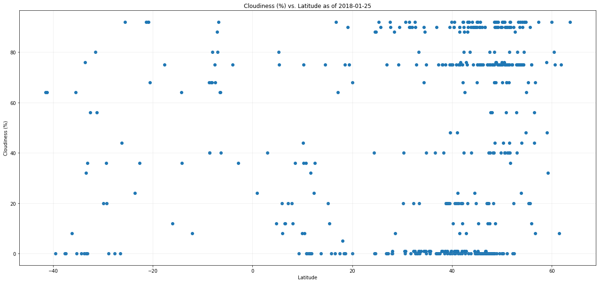

```python
# import libraries
import random, json, pandas, os, requests, datetime
import matplotlib.pyplot as plt
```


```python
# declare constants
with open("city.list.json", "r", encoding = "utf-8") as inbox:
    CITIES = list(map(lambda x: x["id"], random.choices(json.load(inbox), k = 500)))
ball = os.path.dirname(os.path.dirname(os.path.realpath('__file__')))
ball = os.path.join(ball, "keyring.json")
with open(ball) as keyring:
    KEY = json.load(keyring)["weathermap"]
URL = "http://api.openweathermap.org/data/2.5/weather?APPID={}&units=imperial{}".format(KEY, "&id={}")
```


```python
# declare functions
def pretty_picture(df, yaxis):
    """takes a dataframe and the string name of one of its columns. plots a plot with the x axis as latitude and the y axis as the given column"""
    # TODO: actually write this
    plt.figure(figsize = (22, 10))
    plt.scatter(df["Latitude"], df[yaxis], marker = "o")
    # REMEMBER TO SAVE THE PNG, not just show it!
    plt.xlabel("Latitude")
    plt.ylabel(yaxis)
    plt.grid(alpha = .25)
    ball = "{} vs. Latitude as of {}".format(yaxis, datetime.date.today())
    plt.title(ball)
    ball = ball.replace(" ", "_")
    ball = ball.replace(".", "")
    ball = ball + ".png"
    plt.savefig(ball)
    plt.show()
```


```python
# collect data
result = []
for each in CITIES:
    ball = requests.get(URL.format(each)).json()
    with open("city_log.txt", "a", encoding = "utf-8") as outbox:
        outbox.write("requesting data for a city\n\tID number: {}\n\tname: {}\n\trequest URL: {}\n".format(each, ball["name"], URL.format(each)))
    result.append({
        "Latitude": ball["coord"]["lat"],
        "Temperature (F)": ball["main"]["temp"],
        # TODO: make sure temp is in F - done
        "Humidity (%)": ball["main"]["humidity"],
        "Cloudiness (%)": ball["clouds"]["all"],
        "Wind Speed (mph)": ball["wind"]["speed"],
    })
result = pandas.DataFrame(result)
with open("citydata.csv", "w", encoding = "utf-8") as outbox:
    result.to_csv(outbox)
```


<div>
<style>
    .dataframe thead tr:only-child th {
        text-align: right;
    }

    .dataframe thead th {
        text-align: left;
    }

    .dataframe tbody tr th {
        vertical-align: top;
    }
</style>
<table border="1" class="dataframe">
  <thead>
    <tr style="text-align: right;">
      <th></th>
      <th>Cloudiness (%)</th>
      <th>Humidity (%)</th>
      <th>Latitude</th>
      <th>Temperature (F)</th>
      <th>Wind Speed (mph)</th>
    </tr>
  </thead>
  <tbody>
    <tr>
      <th>0</th>
      <td>0</td>
      <td>10</td>
      <td>33.06</td>
      <td>62.13</td>
      <td>5.82</td>
    </tr>
    <tr>
      <th>1</th>
      <td>80</td>
      <td>95</td>
      <td>51.52</td>
      <td>39.32</td>
      <td>10.65</td>
    </tr>
    <tr>
      <th>2</th>
      <td>20</td>
      <td>52</td>
      <td>39.23</td>
      <td>19.40</td>
      <td>2.24</td>
    </tr>
    <tr>
      <th>3</th>
      <td>75</td>
      <td>100</td>
      <td>53.40</td>
      <td>37.80</td>
      <td>8.05</td>
    </tr>
    <tr>
      <th>4</th>
      <td>0</td>
      <td>86</td>
      <td>44.72</td>
      <td>27.50</td>
      <td>6.93</td>
    </tr>
    <tr>
      <th>5</th>
      <td>75</td>
      <td>76</td>
      <td>44.24</td>
      <td>50.00</td>
      <td>8.05</td>
    </tr>
    <tr>
      <th>6</th>
      <td>20</td>
      <td>53</td>
      <td>55.57</td>
      <td>21.20</td>
      <td>11.18</td>
    </tr>
    <tr>
      <th>7</th>
      <td>75</td>
      <td>88</td>
      <td>-4.01</td>
      <td>77.00</td>
      <td>4.70</td>
    </tr>
    <tr>
      <th>8</th>
      <td>36</td>
      <td>80</td>
      <td>-33.12</td>
      <td>80.41</td>
      <td>0.92</td>
    </tr>
    <tr>
      <th>9</th>
      <td>90</td>
      <td>63</td>
      <td>43.17</td>
      <td>27.48</td>
      <td>6.40</td>
    </tr>
    <tr>
      <th>10</th>
      <td>1</td>
      <td>86</td>
      <td>40.92</td>
      <td>38.25</td>
      <td>6.93</td>
    </tr>
    <tr>
      <th>11</th>
      <td>75</td>
      <td>100</td>
      <td>50.10</td>
      <td>35.60</td>
      <td>5.95</td>
    </tr>
    <tr>
      <th>12</th>
      <td>0</td>
      <td>30</td>
      <td>-35.32</td>
      <td>95.00</td>
      <td>8.05</td>
    </tr>
    <tr>
      <th>13</th>
      <td>90</td>
      <td>100</td>
      <td>43.75</td>
      <td>25.75</td>
      <td>5.17</td>
    </tr>
    <tr>
      <th>14</th>
      <td>40</td>
      <td>100</td>
      <td>51.59</td>
      <td>41.04</td>
      <td>11.41</td>
    </tr>
    <tr>
      <th>15</th>
      <td>92</td>
      <td>96</td>
      <td>54.05</td>
      <td>40.40</td>
      <td>4.16</td>
    </tr>
    <tr>
      <th>16</th>
      <td>68</td>
      <td>100</td>
      <td>-7.51</td>
      <td>79.96</td>
      <td>18.70</td>
    </tr>
    <tr>
      <th>17</th>
      <td>24</td>
      <td>94</td>
      <td>-23.62</td>
      <td>73.48</td>
      <td>9.98</td>
    </tr>
    <tr>
      <th>18</th>
      <td>92</td>
      <td>96</td>
      <td>53.68</td>
      <td>41.26</td>
      <td>3.15</td>
    </tr>
    <tr>
      <th>19</th>
      <td>75</td>
      <td>89</td>
      <td>61.90</td>
      <td>37.40</td>
      <td>6.93</td>
    </tr>
    <tr>
      <th>20</th>
      <td>12</td>
      <td>75</td>
      <td>15.44</td>
      <td>84.05</td>
      <td>3.27</td>
    </tr>
    <tr>
      <th>21</th>
      <td>44</td>
      <td>56</td>
      <td>-26.22</td>
      <td>84.01</td>
      <td>7.74</td>
    </tr>
    <tr>
      <th>22</th>
      <td>0</td>
      <td>93</td>
      <td>37.60</td>
      <td>39.20</td>
      <td>1.12</td>
    </tr>
    <tr>
      <th>23</th>
      <td>0</td>
      <td>92</td>
      <td>47.96</td>
      <td>26.60</td>
      <td>4.70</td>
    </tr>
    <tr>
      <th>24</th>
      <td>90</td>
      <td>100</td>
      <td>32.62</td>
      <td>41.00</td>
      <td>2.26</td>
    </tr>
    <tr>
      <th>25</th>
      <td>1</td>
      <td>68</td>
      <td>40.44</td>
      <td>25.00</td>
      <td>8.05</td>
    </tr>
    <tr>
      <th>26</th>
      <td>0</td>
      <td>86</td>
      <td>49.57</td>
      <td>42.82</td>
      <td>8.05</td>
    </tr>
    <tr>
      <th>27</th>
      <td>92</td>
      <td>100</td>
      <td>39.93</td>
      <td>33.88</td>
      <td>13.22</td>
    </tr>
    <tr>
      <th>28</th>
      <td>75</td>
      <td>100</td>
      <td>50.81</td>
      <td>38.59</td>
      <td>4.70</td>
    </tr>
    <tr>
      <th>29</th>
      <td>0</td>
      <td>92</td>
      <td>45.67</td>
      <td>14.00</td>
      <td>2.37</td>
    </tr>
    <tr>
      <th>...</th>
      <td>...</td>
      <td>...</td>
      <td>...</td>
      <td>...</td>
      <td>...</td>
    </tr>
    <tr>
      <th>470</th>
      <td>75</td>
      <td>100</td>
      <td>49.13</td>
      <td>44.19</td>
      <td>3.36</td>
    </tr>
    <tr>
      <th>471</th>
      <td>75</td>
      <td>79</td>
      <td>45.14</td>
      <td>28.40</td>
      <td>13.42</td>
    </tr>
    <tr>
      <th>472</th>
      <td>90</td>
      <td>100</td>
      <td>25.65</td>
      <td>48.20</td>
      <td>3.36</td>
    </tr>
    <tr>
      <th>473</th>
      <td>1</td>
      <td>45</td>
      <td>30.45</td>
      <td>48.20</td>
      <td>3.36</td>
    </tr>
    <tr>
      <th>474</th>
      <td>75</td>
      <td>100</td>
      <td>39.90</td>
      <td>42.80</td>
      <td>10.29</td>
    </tr>
    <tr>
      <th>475</th>
      <td>90</td>
      <td>81</td>
      <td>41.47</td>
      <td>45.72</td>
      <td>26.40</td>
    </tr>
    <tr>
      <th>476</th>
      <td>92</td>
      <td>100</td>
      <td>43.36</td>
      <td>39.68</td>
      <td>3.15</td>
    </tr>
    <tr>
      <th>477</th>
      <td>75</td>
      <td>86</td>
      <td>48.25</td>
      <td>33.80</td>
      <td>1.12</td>
    </tr>
    <tr>
      <th>478</th>
      <td>0</td>
      <td>69</td>
      <td>24.62</td>
      <td>48.05</td>
      <td>2.04</td>
    </tr>
    <tr>
      <th>479</th>
      <td>0</td>
      <td>35</td>
      <td>-34.35</td>
      <td>84.20</td>
      <td>9.17</td>
    </tr>
    <tr>
      <th>480</th>
      <td>75</td>
      <td>86</td>
      <td>53.68</td>
      <td>37.06</td>
      <td>6.93</td>
    </tr>
    <tr>
      <th>481</th>
      <td>0</td>
      <td>85</td>
      <td>44.90</td>
      <td>17.60</td>
      <td>4.70</td>
    </tr>
    <tr>
      <th>482</th>
      <td>75</td>
      <td>100</td>
      <td>49.52</td>
      <td>39.22</td>
      <td>4.70</td>
    </tr>
    <tr>
      <th>483</th>
      <td>88</td>
      <td>78</td>
      <td>24.51</td>
      <td>43.46</td>
      <td>8.86</td>
    </tr>
    <tr>
      <th>484</th>
      <td>92</td>
      <td>100</td>
      <td>50.17</td>
      <td>40.10</td>
      <td>3.36</td>
    </tr>
    <tr>
      <th>485</th>
      <td>56</td>
      <td>86</td>
      <td>47.70</td>
      <td>34.39</td>
      <td>3.36</td>
    </tr>
    <tr>
      <th>486</th>
      <td>20</td>
      <td>70</td>
      <td>15.11</td>
      <td>84.20</td>
      <td>3.36</td>
    </tr>
    <tr>
      <th>487</th>
      <td>20</td>
      <td>83</td>
      <td>41.78</td>
      <td>22.99</td>
      <td>2.26</td>
    </tr>
    <tr>
      <th>488</th>
      <td>40</td>
      <td>100</td>
      <td>50.52</td>
      <td>33.80</td>
      <td>5.82</td>
    </tr>
    <tr>
      <th>489</th>
      <td>0</td>
      <td>22</td>
      <td>35.54</td>
      <td>22.14</td>
      <td>13.87</td>
    </tr>
    <tr>
      <th>490</th>
      <td>75</td>
      <td>93</td>
      <td>45.66</td>
      <td>40.55</td>
      <td>2.24</td>
    </tr>
    <tr>
      <th>491</th>
      <td>92</td>
      <td>88</td>
      <td>54.46</td>
      <td>38.78</td>
      <td>3.38</td>
    </tr>
    <tr>
      <th>492</th>
      <td>44</td>
      <td>100</td>
      <td>56.48</td>
      <td>39.20</td>
      <td>6.93</td>
    </tr>
    <tr>
      <th>493</th>
      <td>0</td>
      <td>86</td>
      <td>27.20</td>
      <td>49.36</td>
      <td>2.82</td>
    </tr>
    <tr>
      <th>494</th>
      <td>92</td>
      <td>75</td>
      <td>48.51</td>
      <td>36.30</td>
      <td>8.05</td>
    </tr>
    <tr>
      <th>495</th>
      <td>0</td>
      <td>93</td>
      <td>48.92</td>
      <td>39.20</td>
      <td>6.93</td>
    </tr>
    <tr>
      <th>496</th>
      <td>12</td>
      <td>55</td>
      <td>45.24</td>
      <td>-32.77</td>
      <td>2.48</td>
    </tr>
    <tr>
      <th>497</th>
      <td>76</td>
      <td>93</td>
      <td>42.81</td>
      <td>45.05</td>
      <td>2.24</td>
    </tr>
    <tr>
      <th>498</th>
      <td>0</td>
      <td>76</td>
      <td>46.28</td>
      <td>28.66</td>
      <td>5.28</td>
    </tr>
    <tr>
      <th>499</th>
      <td>8</td>
      <td>93</td>
      <td>56.71</td>
      <td>41.00</td>
      <td>2.24</td>
    </tr>
  </tbody>
</table>
<p>500 rows × 5 columns</p>
</div>


```python
for each in ["Cloudiness (%)", "Humidity (%)", "Temperature (F)", "Wind Speed (mph)"]:
    pretty_picture(result, each)
```





